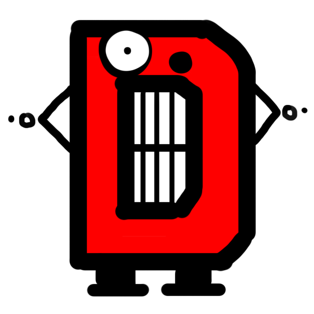
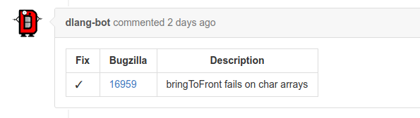
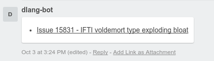
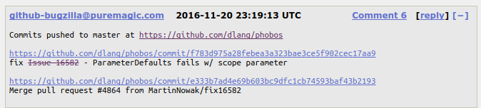

# Dlang-Bot

[](https://travis-ci.org/dlang/dlang-bot)
[](https://codecov.io/gh/dlang/dlang-bot)



Features
--------

- [Automated bugzilla, github, and trello references](#automated-references)
- [Auto-merging approved & passing PRs](#auto-merge)
- [Warn about common mistakes](#warn-common-mistakes)
- [Find stalled PRs](#stalled-prs)
- [Allow PR submitters to label their PRs](#user-tagging)
- [Send contributing advice message](#hello-contributor)
- [Auto-label PRs](#auto-labelling)
- [Using the Dlang-Bot for your project](#dlang-bot-for-your-project)
- [Missing a feature?](#missing-a-feature)

<a name="automated-references" />

Automated references
--------------------

For example let's say you fixed [Issue 16582](https://issues.dlang.org/show_bug.cgi?id=16582)
and make a PR for on GitHub.
If one of your commits mentions the issue, e.g. like this Git commit message:

```
fix Issue 16582 - ParameterDefaults fails w/ scope parameter
```

The Dlang-Bot will do all the hard work of linking and referencing
between Bugzilla, GitHub and Trello do for you.

### GitHub

It would comment on GitHub with list of all mentioned issues and link them to Bugzilla:



The first column of the table is the current status of the referenced issue.
A `✗` means that the issue is only mentioned (i.e. the commit message doesn't contain "Fix")
and the Bugzilla issue won't be auto-closed nor listed in the changelog as fixed:


### Trello

For the [Trello board](https://trello.com/b/XoFjxiqG/active) it will also provide a
reference:



And once a PR gets merged, the bot moves the linked Trello card to "Testing / Review".

### Bugzilla

Once a PR has been merged (i.e. the commits got pushed to master or stable),
GitHub's Bugzilla integration will automatically comment to Bugzilla with a regarding commit:



It will also automatically close the referenced issues if `fix` or `fixes` (case-insensitive)
appears before the issue reference.

Using this syntax is also very important because for the changelog generation, the
git history will be used. Thus _only_ if the Dlang-Bot has detected an issue
and commented on your PR it can become part of the changelog.

In doubt, you can use e.g. [Regex101](https://regex101.com/r/aI0Rp6/7) to validate your commit message.

### Referencing multiple issues

It's possible to reference multiple issues, e.g. with "Fixes issues 17494, 17505, 17506" the Dlang-Bot would detect:


Accepted optional separators are: commas (`,`), the word `and`, as well as the plus sign (`+`),
and any amount of whitespace. Dlang-Bot will aggregate all mentioned issues over multiple commits.

### Nerdy details

- one can mention multiple issues in one commit and/or multiple commits
- the exact RegEx is:

```
(?:^fix(?:es)?(?:\s+(?:issues?|bugs?))?\s+(#?\d+(?:[\s,\+&and]+#?\d+)*))|(?:(?:issues?|bugs?)\s+(#?\d+(?:[\s,\+&and]+#?\d+)*))
```

(the GitHub Bugzilla integration and the Dlang-Bot use the same RegEx to parse
git commit messages)

<a name="auto-merge" />

Auto-merge (WIP)
---------------

At the moment the Dlang-Bot supports merging via special `auto-merge` and
`auto-merge-squash` labels. The later will perform a squashed merge of all commits
in the PR into a single one.

A reviewer can toggle a PR for "auto-merge" by simply adding the `auto-merge` label
(`auto-merge-squash` respectively).


### Nerdy details

- this relies on the "restricted branches" feature of GitHub (the Dlang-Bot will
send the attempt to merge to the GitHub API)
- once a new commit event occurs (push, synchronization) the Dlang-Bot will
automatically remove set all auto-merge labels from the PR
- for status events the GitHub API doesn't allow to get an information about the
- the Dlang-Bot will then try to restart the PR on every new event.
- concerning PR of the commit (thus all potential auto-merge PRs are checked)

_Note_: at the moment the Dlang-Bot doesn't store _any_ authentication token, so
it can't perform actions on behalf of others.

<a name="warn-common-mistakes" />

Warn about common mistakes
--------------------------

The Dlang-Bot will try to detect common mistakes and warn the contributor.
Currently implemented:
- Regression fixes doesn't target `stable`


<a name="stalled-prs" />

Find stalled PRs
----------------

The Dlang-Bot goes over all pull requests every day and will label PRs:

- ["stalled"](https://github.com/dlang/phobos/issues?q=is%3Aopen+is%3Apr+label%3Astalled) (PR has had no activity within 60 days)
- ["needs rebase"](https://github.com/dlang/phobos/issues?q=is%3Aopen+is%3Apr+label%3A%22needs+rebase%22) (PR has a merge conflict)
- ["needs work"](https://github.com/dlang/phobos/issues?q=is%3Aopen+is%3Apr+label%3A%22needs+work%22) (PR has more than two failing CI providers)

Currently this feature is in alpha-mode and only enabled for Phobos.

<a name="user-tagging" />

Allow PR submitters to label their PRs
---------------------------------------

Dlang-Bot detects a pre-defined set of labels in the `[]` part of PR title and will label the PRs accordingly.
Multiple labels are supported.


Currently the hard-coded set of detected labels is:
- WIP
- trivial

<a name="hello-contributor" />

Send contributing advice message
---------------------------------

For all repos in the `dlang` organization Dlang-Bot provides contributing advice on a new PR:


<a name="auto-labelling" />

Auto-label PRs
---------------

If a PR contains [Bugzilla references](#automated-references), the Dlang-Bot will automatically add a respective label:


Of course, other issue types can be detected as well:


<a name="#dlang-bot-for-your-project" />

Using the Dlang-Bot for your project
------------------------------------

The Dlang-Bot is run on Heroku and [deploying your fork](https://tour.dlang.org/tour/en/vibed/deploy-on-heroku) should be pretty straightforward. Just remember to set all environment variables.
Alternatively feel free to ping and we can add your project to our hosted Dlang-Bot.
The GitHub hook for your project should look roughly like this:


- Payload URL: `https://dlang-bot.herokuapp.com/github_hook` (or your own)
- Content type: `application/json`
- Select at least these events (or all): 
  - Label
  - Pull request
  - Pull request review
  - Pull request comment
  - Status

For `auto-merge`:
- an respective label needs to be added (at the `dlang` repositories `#d3d3d3` is used as a label color)
- `@dlang-bot` (or your own bot) needs to have write access to the GitHub repo (GitHub's protected branches are ideal for this)

For example, `dlang/phobos` is configured as follows:


<a name="missing-a-feature" />

Improve the bot
---------------

Run the testsuite:

```
dub test -- --single --debug --trace
```

Missing a feature?
------------------

Is there a feature that you would love the Dlang-Bot to do? Then don't hesistate to let us know and [open a new issue](https://github.com/dlang/dlang-bot/issues/new).
